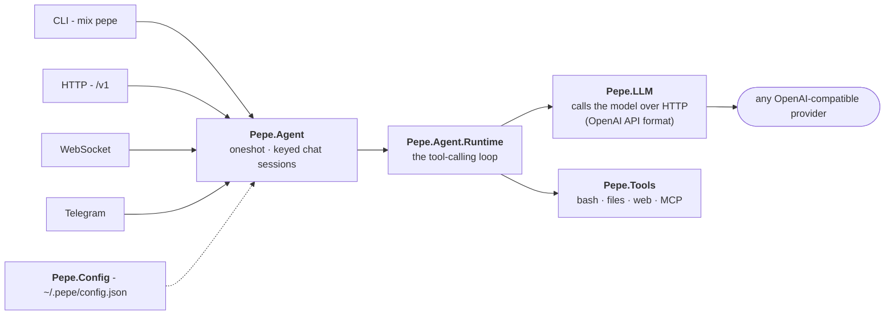

<p align="center">
  
</p>

<h1 align="center">
  &nbsp; Pepe
</h1>

<p align="center">
  <strong>An Elixir/OTP AI agent runtime</strong> - define agents, connect to any model, and run a tool-calling loop.
</p>

<p align="center">
  Web dashboard &nbsp;·&nbsp; OpenAI-compatible HTTP &nbsp;·&nbsp; WebSocket &nbsp;·&nbsp; Telegram &nbsp;·&nbsp; WhatsApp &nbsp;·&nbsp; CLI
</p>

<details>
<summary><b>Why the name "Pepe"?</b></summary>

<br>

Pepe is a character from the beloved Mexican comedy universe of Chespirito
(*El Chapulin Colorado* / *El Chavo del Ocho*) - shows generations across Latin
America and much of the world grew up with. His whole thing? **He did exactly what
he was told.** No arguing, no improvising beyond the order - you say it, Pepe does
it. Which is, funnily enough, a perfect description of an AI agent runtime. The
project used to be called *Cortex*; now it's **Pepe** - same engine, better name.

</details>

**Pepe is an Elixir/OTP AI agent runtime** - define agents, connect to any model,
and run a tool-calling loop. It leans on what Elixir is good at: a lightweight
process per conversation (so many run side by side), supervision that isolates
crashes (one conversation failing never takes the rest down), and a small
streaming HTTP stack.

It exposes those core capabilities several ways:

| Surface | Endpoint | Use it for |
|---|---|---|
| **Web dashboard** | `GET /` (Phoenix LiveView) | Browse sessions and chat from the browser |
| **OpenAI-compatible HTTP** | `POST /v1/chat/completions`, `GET /v1/models` | Point any OpenAI SDK / LangChain / `curl` at Pepe |
| **WebSocket** | `ws://.../socket/websocket`, topic `agent:<name>` | Live, token-streamed conversations |
| **Telegram** | a Telegram bot | Chat with your agent from your phone |
| **Terminal console** | `mix pepe tui` | An interactive console that remembers the conversation |
| **CLI** | `mix pepe ...` | Create agents & model connections, run, serve |

Everything talks to providers over the **OpenAI Chat Completions** protocol, so
OpenAI, OpenRouter, Together, Groq, DeepSeek,
Mistral, z.ai/GLM, Kimi/Moonshot, MiniMax, NovitaAI, Ollama, LM Studio, vLLM,
llama.cpp and any other compatible endpoint work with zero code changes.

---

## Contents

**Start here:** [Architecture](#architecture) · [Quick start](#quick-start) · [CLI reference](#cli-reference-mix-pepe) · [Configuration](#configuration-pepeconfigjson) · [Tests](#tests) · [Contributing](#contributing--help-wanted)

**Talk to it:** [Web dashboard](#web-dashboard) · [HTTP API](#openai-compatible-http-api) · [WebSocket](#websocket) · [Telegram](#telegram) · [WhatsApp](#whatsapp-meta-cloud-api)

**Agents:** [Admin agents](#admin-agents-manage--train-other-agents) · [Permissions](#permissions) · [Agent-to-agent routing](#agent-to-agent-routing) · [Companies](#companies-multi-tenant-isolation) · [Skills](#skills) · [Learning](#learning-self-improvement--timelearn) · [Adding a tool](#adding-a-tool) · [Self-management](#self-knowledge--self-management-how-an-agent-operates-pepe)

**Automation & ops:** [MCP servers](#mcp-servers-external-tools) · [Scheduled tasks](#scheduled-tasks-cron) · [Watches](#watches---notify-me-when-x-one-shot) · [Usage & billing](#usage-metering--billing) · [Privacy hooks](#privacy-hooks-pii-redaction)

---

## Architecture

Four surfaces feed one facade. The runtime then loops - **call the model -> run any
tool calls -> feed the results back** - until it has a final answer. Everything is
configured from a single JSON file; there is no database.



| Module | What it does |
|---|---|
| **`Pepe.Config`** | File-backed store at `~/.pepe/config.json`. Secrets written as `${ENV_VAR}` are interpolated at read time. No database. |
| **`Pepe.LLM`** | Talks to the model over HTTP in the OpenAI API format - either waiting for the whole reply or streaming it token by token. Reassembles streamed tool calls from fragments. |
| **`Pepe.Tools`** | A `@behaviour` plus a built-in registry (`bash`, `read_file`, `write_file`, `edit_file`, `fetch_url`, `web_search`, `skill`, self-config tools...). Drop-in `.exs` plugins extend it with no recompile. |
| **`Pepe.Agent.Runtime`** | The conversation loop: call model -> run tools -> feed back -> repeat until a final answer or `max_iterations`. Emits lifecycle events (`:assistant_delta`, `:tool_call`, `:tool_result`, `:done`). |
| **`Pepe.Agent.Session`** | One `GenServer` per conversation key (e.g. `telegram:12345`), under a `DynamicSupervisor` + `Registry`. Runs execute off-process, so a session stays responsive (e.g. to `/stop`). Crash isolation and context retention for free. |
| **`Pepe.Permissions`** | Gates risky tool calls (running code, writing files, changing config). Each surface renders the prompt natively; read-only tools run freely. |
| **Gateways** | `Pepe.Gateways.Telegram` (long polling) and `Pepe.Gateways.TUI` (the console). They start only on `serve`/`gateway`, so a local `run`/`tui` never spins up the poller. |

> **Web vs non-web surfaces.** `lib/pepe/gateways/` holds the non-web surfaces (the
> Telegram poller, the TUI console). Everything served by the Phoenix endpoint - the
> OpenAI-compatible API, the WebSocket channel, and the LiveView dashboard - lives in
> `lib/pepe_web/`.

---

## Quick start

```bash
mix deps.get

# 1) scaffold ~/.pepe/config.json
mix pepe setup

# 2) add a model connection (any OpenAI-compatible provider)
mix pepe model add openrouter \
  --base-url https://openrouter.ai/api/v1 \
  --api-key '${OPENROUTER_API_KEY}' \
  --model anthropic/claude-3.5-sonnet \
  --default

# 3) define an agent (defaults to all built-in tools)
mix pepe agent add assistant \
  --prompt "You are Pepe, a helpful coding agent." \
  --tools bash,read_file,write_file,edit_file,list_dir,fetch_url,web_search \
  --default

# 4) run it
export OPENROUTER_API_KEY=sk-...
mix pepe run "list the files here and summarize the project"
```

## CLI reference (`mix pepe`)

> In development use `mix pepe ...`. The standalone `pepe` binary
> (`mix escript.build`, or a Burrito release) takes the same subcommands.

### Setup

```bash
mix pepe setup        # first run: guided wizard (language -> model -> agent -> Telegram)
                        # later runs: a menu to add/reconfigure any part
```

### Model connections

```bash
mix pepe model                       # show the default + switch among saved / add a new one
mix pepe model add openai            # guided: pick provider -> auth method -> model
mix pepe model add openrouter \
  --base-url https://openrouter.ai/api/v1 \
  --api-key '${OPENROUTER_API_KEY}' \
  --model anthropic/claude-3.5-sonnet --default      # fully manual
mix pepe model providers             # list known providers (OpenAI, Anthropic, Gemini, ...)
mix pepe model models --base-url https://api.openai.com/v1 --api-key '${OPENAI_API_KEY}'
mix pepe model list                  # list saved connections
mix pepe model test [NAME]           # ping a connection to verify the key/endpoint work
mix pepe model remove openrouter
mix pepe model default openai
```

ChatGPT/Codex and Claude Pro/Max can be added by **subscription sign-in** -
`mix pepe model add openai` -> "ChatGPT / Codex subscription" opens your browser
(OAuth PKCE), captures the token, and refreshes it automatically.

### Agents

```bash
mix pepe agent add assistant \
  --prompt "You are a helpful coding agent." \
  --tools bash,read_file,write_file,edit_file,list_dir,fetch_url,web_search --default
mix pepe agent list
mix pepe agent route zak helper        # let zak message another agent (see Routing)
mix pepe agent rename assistant zak   # rename + move its workspace dir (~/.pepe/agents/<name>/)
mix pepe agent remove zak
mix pepe agent default assistant
mix pepe agent help                    # (or `mix pepe help agent`)
```

### Companies (multi-tenant, optional)

Host isolated tenants in one deployment. Without `--company`, everything uses the
**root** scope, exactly as a single-tenant install always has - so this is entirely
opt-in. Add `--company NAME` to scope a command to a company; its agents,
workspaces, `shared/` space and models are walled off from every other company (see
**[Companies](#companies-multi-tenant-isolation)**).

```bash
mix pepe company add acme --description "Acme Inc"     # create a tenant scope
mix pepe company list
mix pepe company rename acme umbrella                  # re-key everything to a new name
mix pepe agent add vendas --company acme --prompt "..."  # agent "acme/vendas"
mix pepe agent list --company acme                     # only Acme's agents
mix pepe agent list --all                              # every scope
mix pepe run acme/vendas "hello"                       # run it by its handle
mix pepe company remove acme --force                   # drop the company + its agents
```

### Running

```bash
mix pepe run "list the files here and summarize the project"   # one-shot, streams to stdout
mix pepe run assistant "hello"                                 # pick an agent explicitly
mix pepe tui                         # interactive console, keeps the session
mix pepe tui --agent zak             # ...with a specific agent (or: mix pepe tui zak)
mix pepe serve --port 4000           # OpenAI-compatible HTTP API + WebSocket
```

`tui` (alias: `chat`) opens a session-backed console - it keeps context across
turns and prints a summary box (agent · model · session) on open. The same slash
commands as the other gateways work: `/new`, `/undo`, `/compact`, `/status`,
`/agent <name>`, `/help`, `/exit`. Replies stream as they arrive, and a risky tool
asks for permission through an arrow-key menu (see **Permissions**).

### Telegram gateway

```bash
mix pepe gateway telegram setup      # interactive: bot token, allowlists, which agent
mix pepe gateway telegram            # run the gateway in the foreground (long-polling)
```

### Misc

```bash
mix pepe tools                       # list available tools (built-ins + plugins)
mix pepe timelearn [AGENT]           # what the agent has learned, on a timeline
mix pepe cron list|add|run|logs ...    # scheduled tasks (see Scheduled tasks)
mix pepe config                      # show config path + a summary
mix pepe help                        # full command help (or: help <group>)
```

## Web dashboard

A Phoenix LiveView dashboard at **`/`** - a live list of sessions on the left and a
streaming chat panel on the right. Pick a session to read its history and talk to
its agent; replies stream in token-by-token. `New chat` starts a fresh session, and
each session shows its agent, model and turn count. The left sidebar mirrors the
CLI, so almost everything you can do with `mix pepe` you can do here:

- **Chat** - talk to a session (risky tools prompt inline).

- **Companies** - create/edit/delete tenant scopes and their billing markup (see **Companies**).

- **Agents** - create/edit/delete agents: persona, model, tools, routes, admin scope,
  default.

- **Models** - add/remove/edit model connections, set per-model prices, pick the default.

- **Usage & billing** - token usage and cost by cycle, per company (see **Usage metering & billing**).

- **Learning** - the TimeLearn timeline (see **Learning**).

- **Scheduled** - create/run/manage scheduled tasks (see **Scheduled tasks**).

- **Watches** - one-shot "notify me when X" (see **Watches**).

- **Channels** - add/remove/edit Telegram bots, applied live (see **Telegram -> Multiple bots**).

- **MCP** - external tool servers (see **MCP servers**).

- **Config file** - edit `~/.pepe/config.json` inline, validated on save.

```bash
mix assets.build          # once (builds css/js)
mix pepe serve          # API + dashboard + gateways, one process
# open http://localhost:4000
```

Because sessions are in-process, run everything from the **one** `mix pepe serve`
process and the dashboard sees every session - including the ones from Telegram.
Risky tools are authorized inline on the dashboard too: the run pauses and shows an
allow/deny prompt (the web version of the Telegram buttons), unless the agent has
pre-approved the tool (the omnipotent primary agent never prompts).

## OpenAI-compatible HTTP API

```bash
mix pepe serve         # or: PHX_SERVER=true mix phx.server
```

```bash
# The "model" field selects an Pepe AGENT by name (so its tools/persona apply);
# falls back to a bare model connection, then the default agent.
curl http://localhost:4000/v1/chat/completions \
  -H 'content-type: application/json' \
  -d '{"model":"assistant","messages":[{"role":"user","content":"hello"}]}'

# streaming (Server-Sent Events)
curl -N http://localhost:4000/v1/chat/completions \
  -H 'content-type: application/json' \
  -d '{"model":"assistant","stream":true,"messages":[{"role":"user","content":"hi"}]}'

curl http://localhost:4000/v1/models
curl http://localhost:4000/health
```

Works with the official OpenAI SDKs - just set the base URL to
`http://localhost:4000/v1` and the model to your agent's name.

### Access tokens (per company or per agent)

The `/v1` API is **open until you create the first token** - then every call needs
a valid `Authorization: Bearer ctx_...`. A token is stored only as a SHA-256 hash (the
raw value is shown once), and its scope decides what it can reach:

| Scope | Created with | Can call |
| --- | --- | --- |
| **Agent** | `--agent HANDLE` | only that agent (the `model` field is ignored) |
| **Company** | `--company CO` | any agent in that company (bare names qualify into it); other companies -> `403` |
| **Root** | neither | root agents + bare model connections |

```bash
mix pepe token add --company acme --label "acme mobile app"   # prints ctx_... once
mix pepe token add --agent acme/vendas --label "single integration"
mix pepe token list       # id · fingerprint · scope · label
mix pepe token revoke <id>

# then callers must authenticate
curl http://localhost:4000/v1/chat/completions \
  -H 'authorization: Bearer ctx_...' \
  -H 'content-type: application/json' \
  -d '{"model":"vendas","messages":[{"role":"user","content":"oi"}]}'   # "vendas" -> acme/vendas
```

The token is read from `Authorization: Bearer ...` (the OpenAI standard, what the
official SDKs send) or, as a fallback, the Azure-style `api-key: ...` header.

`GET /v1/models` is filtered to the token's scope, so a client only ever sees the
agents it may use. This is what makes the [company isolation](#companies-multi-tenant-isolation)
real over the network - without a token the API can reach any agent.

### Stateful sessions

By default the endpoint is stateless (you send the full `messages` array each
time, like OpenAI). Pass a **session id** and the server keeps the whole
conversation for you - then you only need to send the latest user message.

Three equivalent ways (first match wins):

* `"session_id": "abc"` in the JSON body, **or**

* `"user": "abc"` - the standard OpenAI field, **or**

* an `X-Session-Id: abc` request header.

```bash
# turn 1
curl http://localhost:4000/v1/chat/completions -H 'content-type: application/json' \
  -d '{"model":"assistant","user":"u-42","messages":[{"role":"user","content":"my name is John Doe"}]}'

# turn 2 - same "user", server remembers turn 1
curl http://localhost:4000/v1/chat/completions -H 'content-type: application/json' \
  -d '{"model":"assistant","user":"u-42","messages":[{"role":"user","content":"what is my name?"}]}'
```

Each session is its own supervised process, keyed by `api:<id>`
(`Pepe.Agent.Session`). Streaming works with sessions too. WebSocket and Telegram are stateful by design
(per-connection / per-chat-id). An empty `user`/`session_id` (`""`) is treated as
stateless.

## WebSocket

Connect to `ws://localhost:4000/socket/websocket` (Phoenix Socket protocol) and
join topic `agent:<name>` (`agent:default` for the default agent).

* push `"prompt"` `{ "text": "..." }` -> receive streamed `"delta"`, `"tool_call"`,
  `"tool_result"`, then `"done"` events.

* push `"reset"` to clear history.

Auth mirrors the [`/v1` API](#access-tokens-per-company-or-per-agent): open until
tokens exist, then pass one as a **connect param** (a WebSocket can't set headers) -
`ws://localhost:4000/socket/websocket?token=ctx_...`. The token's scope is enforced on
`join`: a client can only join `agent:` topics its token allows (`agent:default`
resolves to the scope's default), and a company token joining another company's agent
is refused. Bare names qualify into the token's company (`agent:vendas` -> `acme/vendas`).

## Telegram

Configure interactively (creates a bot via [@BotFather](https://t.me/BotFather)
first), then run the long-polling gateway (no webhook needed):

```bash
mix pepe gateway telegram setup      # bot token, allowlists, which agent answers
mix pepe gateway telegram            # run it
```

Each chat is a persistent session. In-chat slash commands (also shown in the "/"
menu, in your configured language):

```
/new        start a fresh conversation        /status   show session info
/undo       undo your last message            /whoami   show your user/chat id
/compact    summarize history to free context /model    show or set the model
/stop       cancel the current run            /models   list configured models
/agent X    switch agent                      /tools    list runtime tools
/skill [X]  list skills, or run one by name   /approve  manage saved permissions
/btw <q>    ask a side question (not saved)    /help     list commands
```

Installed **skills are also surfaced as their own slash commands** (e.g. a
`weather` skill shows up as `/weather`), so they're discoverable from the "/" menu.

`/whoami` is the easy way to find the ids for the allowlists. Config keys under
`"telegram"`: `bot_token`, `enabled`, `allowed_chats`, `allowed_users`,
`require_mention` (only reply when @mentioned in groups), `agent`. Fixed system
messages follow the configured `locale`; the agent's own replies follow the user's
language, and raw internal errors are never leaked into the chat.

A **dead chat is self-healing**: if a send comes back permanently failed (bot
blocked, chat/user gone), that chat is skipped on every further send - no wasted API
calls or log noise - and automatically un-marked the moment a send to it succeeds
again (e.g. the user un-blocked the bot). No manual reset needed.

**"Working" activity while the agent runs** is deliberately ambient, not a status
report you're meant to read. Tune it per bot with `tool_progress`:

- `reaction` (default) - a 👀 reaction on your own message while the agent works,
  cleared when the answer lands. No extra message in the chat; the quietest signal.

- `ambient` - a single vague line ("🔎 looking things up...", "💻 running something...")
  edited in place and deleted when done. No tool names, args or ledger.

- `off` - nothing but the native "typing..." indicator.

- `verbose` - a per-tool breadcrumb list (for power users).

The native "typing..." indicator stays alive across all modes. Set it from chat
(`manage_channel` -> `set_progress`) or the CLI (`--progress`).

### Heartbeat - proactive check-ins (opt-in)

A bot can periodically give its agent the floor to say something **on its own
initiative** ("the deploy finished", "you asked me to watch for X") - and, just as
importantly, the right to say **nothing** most of the time. Off by default:

```bash
# via the manage_channel tool (an agent can set this up itself, from chat):
manage_channel set_heartbeat name: "sales" heartbeat_minutes: 30 heartbeat_hours: "8-22"
```

Each pulse runs the agent on its session's live context with a prompt that says
"this is an automatic check - reply with exactly `HEARTBEAT_OK` if there's nothing
worth saying." That's the common case; only a genuine message gets sent. Feed it:

- an optional `HEARTBEAT.md` in the agent's workspace ("what to watch for"),

- **system events** any part of Pepe can queue for a session
  (`Pepe.Heartbeat.Events.push/2`) and the next pulse picks up automatically.

A cooldown gate (30s min spacing, a 5-fires/60s flood breaker) makes a runaway
proactive loop impossible, and `heartbeat_hours` ("8-22") keeps it quiet outside
local waking hours.

### Multiple bots, one per agent

You can run **several bots at once, each bound directly to its own agent** - one
Telegram bot *is* agent X, another *is* agent Y. Pepe starts one poller per bot;
each has its own token, bound agent, allowlists and session namespace.

```bash
mix pepe gateway telegram setup                        # the default bot
mix pepe gateway telegram add sales --token $T --agent sales-bot
mix pepe gateway telegram add ops   --token $T2 --agent ops-bot
mix pepe gateway telegram list                         # see them all
mix pepe gateway telegram                              # runs every bot
```

The default bot lives under `"telegram"`; extra bots under `"telegrams"` (a
name->config map) in `~/.pepe/config.json`, each accepting the same keys. Bots
that resolve to the same token are de-duplicated (two pollers on one token would
conflict). The default bot keeps the `telegram:<chat_id>` session key; named bots
use `telegram:<name>:<chat_id>`, so their conversations (and cron delivery) never
collide. You can also manage bots live from the **Bots** tab in the dashboard -
add/remove there and the running pollers reconcile without a restart.

Within a single bot you can still switch agent per chat with `/agent X` (see
**Agent-to-agent routing**); dedicated bots are for when a whole channel should
*be* one agent.

#### Let an agent add a bot from chat

An agent can create and manage bots itself with the `manage_channel` tool - *"add
a bot for the sales agent, token in `$SALES_BOT_TOKEN`"* - as long as the tool is in
its allowlist. It's guarded two ways:

- **Permission gate** - `manage_channel` is a risky tool, so each call is authorized
  by the human (or pre-approved), like any risky tool.

- **Scoped** - it only touches named bots, never the protected `default` bot or any
  other config.

- **Secrets never pass through the chat** - you give the *name of an environment
  variable* holding the token (`token_env: "SALES_BOT_TOKEN"`), not the token; it's
  stored as `${SALES_BOT_TOKEN}` and resolved at read time, so the raw secret never
  reaches the model or the logs. Set that env var yourself.

After a change the running pollers reconcile live. Actions: `add`, `list`,
`set_agent`, `enable`, `disable`, `remove`.

## WhatsApp (Meta Cloud API)

Connect **official WhatsApp** numbers via Meta's Cloud API. Unlike Telegram (which
Pepe polls), WhatsApp **pushes** inbound messages to a webhook, so each connection
gets its own URL:

```
/webhooks/:company/:provider/:slug        e.g.  /webhooks/acme/whatsapp/suporte
```

This is one generic webhook surface (a provider registry - WhatsApp today, others
later), not WhatsApp-specific plumbing. The `:company` segment is `root` for the
no-company scope. `GET` answers Meta's verification handshake; `POST` is an inbound
message - its `X-Hub-Signature-256` is verified against the app secret, then the
bound agent runs and the reply is sent back over the Graph API. Served by
`mix pepe serve` (no extra process).

You can run **as many connections as you like**, each bound to an agent - the
webhook analogue of Telegram's multi-bot. A connection has a **mode**:

| | **admin** (yours) | **support** (customer-facing) |
|---|---|---|
| Slash commands | on (`/new` resets) | off (treated as text) |
| Who may message | `allowed_numbers` (your number) | anyone |
| Learns? (`trainers`) | you're a trainer | `[]` - never learns from a customer |
| Agent tools | full | keep it locked (safe tools only - no human to approve) |
| Session | kept | ephemeral + idle TTL |

```bash
# add a support number (tokens default to ${WA_TOKEN_<SLUG>} / ${WA_APP_SECRET_<SLUG>})
mix pepe gateway whatsapp add suporte \
  --agent acme/atendimento --company acme --mode support \
  --phone-number-id 123456789 --ttl-min 30
mix pepe gateway whatsapp list                 # connections + their Callback URLs
mix pepe gateway whatsapp set-agent suporte acme/vendas
mix pepe gateway whatsapp remove suporte
```

...or add one from the **Channels** tab in the dashboard. Then register the printed
Callback URL and verify token in your Meta app (subscribe the `messages` field).

**On the Meta side** (once per number): create an app -> add WhatsApp -> note the
`phone_number_id`, generate a permanent access token (`${WA_TOKEN_<SLUG>}`), copy the
App Secret (`${WA_APP_SECRET_<SLUG>}`), and point the Callback URL at your slug.

**The session** is keyed `whatsapp:<agent>:<phone>` - the agent's thread with that
customer, isolated per company via the agent handle. Two things end it: the agent
calls the **`end_session`** tool when the exchange is done (clears the context for
the next message), or the **idle TTL** (`--ttl-min`, unset = never) evicts a quiet
session. Dynamic routing to a specialist is just the agent using `send_to_agent`
(see **Agent-to-agent routing**).

> **24-hour window.** Meta only allows free-form replies within 24h of the
> customer's last message. Reactive support fits; proactive sends outside the window
> need pre-approved templates (not handled here).

## Privacy hooks (PII redaction)

Opt-in transforms plugged into the message flow, so an agent can redact PII before
it ever reaches an external model, and restore it in the reply. An agent with no
hooks runs raw, exactly as before. Enable per agent (`--hooks`, or the Agents form),
inherit a company default (`default_hooks`), and configure each hook once under
`"hooks"` in the config.

Four hooks, one contract, so they compose (each feeds the same reversible map):

- **`pii_redact`** - offline regex: recognizers (email, card via Luhn, CPF/CNPJ with
  checksums, CEP, phones) grouped into packs (`intl`, `br`, `us`) plus your own
  `custom` `{name, pattern, replace}`. Tokenizes structured PII and restores it out.

- **`llm_redact`** - a configured/local model replaces PII with realistic pseudonyms
  and returns a `fake -> real` map, kept consistent across turns. Handles names and
  free text the regex can't, in any language, and keeps the data off the main model.

- **`http_redact`** - your own endpoint decides. Pepe POSTs
  `{stage, text, session, map}`; you return `{text, map}`. Auth via `basic_auth` or
  arbitrary `headers` (all `${ENV}`).

- **`presidio`** - Microsoft Presidio's Analyzer + Anonymizer over HTTP (self-hosted).

```bash
mix pepe agent add support --hooks pii_redact,llm_redact --company acme --prompt "..."
mix pepe hooks list
# let a model build a validated pii_redact config from plain language:
mix pepe hooks generate "cpf, cnpj and our policy numbers APOL-12345678" --model local --save
```

**A hard guarantee.** Mark a model connection **require_redaction** and the runtime
refuses to send to it unless the agent runs a redaction hook - so a forgotten agent
config can never leak raw PII to that provider. Redaction runs off-process, so an
LLM-backed hook never blocks the session; the reversible map lives only in memory and
is cleared on reset / `end_session` / TTL eviction.

## Admin agents (manage & train other agents)

An agent can administer and **train other agents** - set their persona, model, tools,
and memory, or create new ones - with the `manage_agent` tool. Authority is a
**directed, per-agent allowlist** (`can_manage`), so you can have several admins,
each scoped to different agents:

| `can_manage`      | means                                             |
|-------------------|---------------------------------------------------|
| *omitted* / `nil` | itself only (default)                             |
| `[]`              | nobody, not even itself (a locked client agent)   |
| `[a, b]`          | exactly those (add its own name to include self)  |
| `["*"]`           | every agent (an explicit super-admin)             |

```bash
mix pepe agent manage boss vendas        # boss can now administer "vendas"
mix pepe agent manage boss "*"           # a super-admin over all agents
mix pepe agent add child --can-manage none   # a locked agent that can't alter itself
```

`manage_agent` actions: `list`, `get`, `create`, `set_persona`, `set_model`,
`add_tool`, `remove_tool`, `remember` (append a fact to the target's memory). It's a
risky tool, so each use is authorized through the permission gate; persona and memory
live in the target's workspace, tools/model in its config.

## Permissions

The **primary agent** - the one created on first `mix pepe setup` (the owner's own
agent) - is born **omnipotent**: every tool, super-admin over all agents
(`can_manage: ["*"]`), and a `"*"` auto-approve grant so it runs any tool without a
prompt. It can do everything via chat from the start. Agents you add later are
scoped normally.

Before a **risky** tool runs - running code (`bash`, `run_script`), writing/moving
files, changing config, or any plugin tool - Pepe asks you to authorize it
(unless the agent has approved it - `"*"` approves everything).
Read-only tools (`read_file`, `list_dir`, `fetch_url`, `web_search`, ...) run freely.

Each surface renders the prompt natively - **Telegram** shows inline buttons, the
**console** an arrow-key menu - but the four choices are the same everywhere:

| Choice | Effect |
|---|---|
| **Allow once** | just this call; ask again next time |
| **Allow for this session** | the rest of this session (forgotten on `/new` and on restart) |
| **Always allow** | from now on - persisted on the agent (`auto_approve` in `config.json`) |
| **Don't allow** | refuse; never remembered, so it's asked again |

Manage the persistent grants from chat with `/approve` (list), `/approve clear`, or
`/approve clear <tool>`. Surfaces with no human to ask (the HTTP API) run tools
without prompting.

## Agent-to-agent routing

Agents can message each other through the `send_to_agent` tool, governed by a
**directed allowlist** - each agent's `can_message` lists who *it* may message, so
`A -> B` does **not** imply `B -> A`. The called agent answers in a fresh run and its
reply comes back as the tool result; a hop limit and cycle check stop chains from
looping.

```bash
# A can message B; B can message C and D; C can message A and B
mix pepe agent route A B
mix pepe agent route B C
mix pepe agent route B D
mix pepe agent route C A
mix pepe agent route C B
mix pepe agent route A B --remove        # revoke a route

# or set it when creating the agent
mix pepe agent add A --model mock --can-message B
```

```jsonc
"agents": {
  "A": { "can_message": ["B"] },
  "B": { "can_message": ["C", "D"] },
  "C": { "can_message": ["A", "B"] }
}
```

Add `send_to_agent` to an agent's `tools` to let it route. The route allowlist is
the authorization, so the call itself isn't put through the human permission gate -
but the callee's own risky tools still are.

Routes can also be changed **from chat**: give an agent the `set_route` tool and it
can add/remove routes (`{from, to, action}`, `from` defaults to itself) - guided by
the `manage-routing` skill. Since it edits config, the change goes through the
permission prompt.

## Companies (multi-tenant isolation)

Optional. A **company** is an isolated tenant scope, so one deployment can serve
many clients whose data never crosses. It is entirely opt-in: with no company,
everything lives in the **root** scope - identical to a single-tenant install - and
that's what every command uses without `--company`. Most deployments never need a
company; add one only when you must wall tenants off.

An agent's identity is a **handle**: a bare name in root (`vendas`) or
`company/name` inside a company (`acme/vendas`). The same bare name can be reused
per company - `acme/vendas` and `globex/vendas` are different agents. Because the
handle is what keys everything (config, workspace, sessions, routes), isolation
follows automatically:

- **Files** - a company agent's workspace is `~/.pepe/companies/<co>/agents/<name>/`
  and its shared space is `~/.pepe/companies/<co>/shared/`, so equally named agents
  in different companies never collide and `shared/...` paths never leak across tenants.
  Root agents keep `~/.pepe/agents/<name>/` and `~/.pepe/shared/`.

- **Routing** - `send_to_agent` never crosses companies: a bare target resolves to a
  peer in the sender's own company, and a hard guard refuses any cross-company route
  even if an allowlist asks for it.

- **Models/keys** - a company agent resolves its own models first, then root, so a
  company can pin private provider keys other companies can't see - or inherit one
  shared global provider. A company agent/model never becomes the global default.

```bash
mix pepe company add acme --description "Acme Inc"
mix pepe company add globex
mix pepe company list

# agents, models, routes all take --company
mix pepe model add llm  --company acme --base-url ... --api-key '${ACME_KEY}' --model ...
mix pepe agent add vendas  --company acme --prompt "..." --can-message suporte
mix pepe agent add suporte --company acme --prompt "..."
mix pepe agent route vendas suporte --company acme   # both resolve inside acme

mix pepe agent list --company acme    # only Acme's
mix pepe agent list                   # only root
mix pepe agent list --all             # every scope
mix pepe tui --company acme vendas    # or: mix pepe run acme/vendas "..."

mix pepe company rename acme umbrella # re-keys its agents, models, routes,
                                      # crons, watches, bots, tokens and files
mix pepe company remove acme          # refuses while it owns agents...
mix pepe company remove acme --force  # ...unless forced (drops its agents too)
```

```jsonc
"companies": { "acme": { "description": "Acme Inc", "default_model": "llm" } },
"agents": {
  "assistant":    { "can_message": [] },          // root scope
  "acme/vendas":  { "can_message": ["acme/suporte"] },
  "acme/suporte": { "can_message": [] }
}
```

A Telegram bot bound to a company agent keeps its whole conversation inside that
company; without a company it serves root, as before.

## Configuration (`~/.pepe/config.json`)

```jsonc
{
  "default_model": "openrouter",
  "models": {
    "openrouter": {
      "base_url": "https://openrouter.ai/api/v1",
      "api_key": "${OPENROUTER_API_KEY}",
      "model": "anthropic/claude-3.5-sonnet",
      "max_tokens": 4096
    }
  },
  "default_agent": "assistant",
  "agents": {
    "assistant": {
      "model": "openrouter",
      "system_prompt": "You are Pepe, a helpful agent.",
      "tools": ["bash", "run_script", "read_file", "write_file", "edit_file", "list_dir", "fetch_url", "web_search"],
      "auto_approve": ["read_file"],
      "max_iterations": 12
    }
  },
  "telegram": { "bot_token": "${TELEGRAM_BOT_TOKEN}", "allowed_chats": [], "require_mention": true },
  "locale": "en",
  "server": { "port": 4000 }
}
```

Override the location with `PEPE_HOME` (directory) or `PEPE_CONFIG` (file).
Each agent also gets a persistent directory at `~/.pepe/agents/<name>/` holding
its `SOUL.md` (persona) and any files it creates (`MEMORY.md`, `people.md`, ...);
`~/.pepe/shared/` is shared across agents.

An agent with **no identity yet** (no `SOUL.md`, default seed) presents itself as
Pepe, tells you it has no name or characteristics defined, and offers to set one
up - then saves your choices to `SOUL.md` and renames itself with `rename_agent`.
`auto_approve` lists tools the agent may run without asking (see **Permissions**).

### Storage & backup - it's all files, no database

Everything lives under `~/.pepe/` (or `PEPE_HOME`) - there is **no database
server**. `config.json` is the single source of truth (companies, agents, models,
watches, crons, bots, MCP, hashed API tokens). Agent knowledge lives as files in
`agents/<name>/` and `companies/<co>/agents/<name>/`; conversation history in
`data/sessions/`; `data/mnesia/` is a disposable cache (rebuilds itself). `Pepe.Repo`
+ Postgres exist in the code but are **off** (`ecto_repos: []`) - the door for a future
DB backend, unused today.

Secrets are never stored raw - they're `${ENV_VAR}` references resolved at read time,
so they live in your environment, not the files.

Back up with one command - it archives the durable parts, skips the disposable cache,
and lists the secret env vars you must save separately (they're not in the archive):

```bash
mix pepe backup                       # -> pepe-backup-YYYY-MM-DD.tgz
mix pepe backup --output /path/x.tgz
```

Restore = extract back into `~/` (or `PEPE_HOME`'s parent) and re-export those env
vars. That's the whole disaster-recovery story.

## MCP servers (external tools)

Connect **MCP (Model Context Protocol)** servers - Sentry, GitHub, ... - and their
tools become callable by agents as if built in. Servers launch over stdio on demand
(via `npx`, so **nothing to install manually**); tokens go in as `${ENV_VAR}` refs.

```bash
mix pepe mcp add sentry --command npx \
  --args "-y @sentry/mcp-server@latest --access-token ${SENTRY_AUTH_TOKEN}"
mix pepe mcp tools sentry     # launch it and list its tools (validate the connection)
mix pepe mcp list
```

Each MCP tool is exposed as `mcp__<server>__<tool>`. **Scoping is just the tool
allowlist** - to make an agent *read-only* against a server, give it only the read
tools and leave the mutating ones out:

```bash
mix pepe agent add backoffice --tools read_file,mcp__sentry__find_organizations,mcp__sentry__get_issue
# (no mcp__sentry__update_issue -> the agent can look, not change)
```

`mcp__sentry__*` grants all of a server's tools. MCP tools are risky, so each call
still goes through the permission gate. An agent with the `manage_mcp` tool can add
and validate servers itself from chat (secrets stay as `${ENV}` refs). Definitions
live in `~/.pepe/config.json` under `"mcp"`.

## Self-knowledge & self-management (how an agent operates Pepe)

Pepe is designed so an agent can **resolve requests about Pepe itself** - "add a
bot", "schedule this", "connect Sentry", "switch the timezone" - without bespoke
hand-holding, and without ever being dangerous:

- **It reads its own docs.** How-to guides ship under `priv/docs/` (agents, channels,
  cron, MCP, permissions, config) and are listed in every agent's system prompt as
  the *authoritative* source; the read-only `docs` tool loads the relevant one on
  demand. New/unforeseen requests get resolved by reading, not guessing. (Drop extra
  guides in `~/.pepe/docs/` to extend or override.)

- **It discovers what's editable.** `config_set` called with no arguments returns the
  schema - the editable settings, their current values and accepted values. The
  editable set is a **fail-closed allowlist** (`default_model`, `default_agent`,
  `language`, `timezone`, `telegram.require_mention/enabled`); anything else is
  refused with a pointer to the right guarded tool (`manage_agent`, `manage_channel`,
  `manage_mcp`, `schedule_task`). Secrets are never editable from chat.

- **It verifies its own work.** After changing something, the agent (or you) runs the
  **doctor**: offline checks (every `${ENV}` ref resolves, agents point at real
  models and known tools, cron schedules/timezones/agents are valid) plus live probes
  (Telegram `getMe` per bot, a ping per model connection, an MCP launch + tool list
  per server).

```bash
mix pepe doctor              # live probes (Telegram, models, MCP)
mix pepe doctor --offline    # config-consistency only, no network
```

The loop is **do -> verify -> correct**: structured guarded tools for the hot paths,
generic tools + docs for everything else, and the doctor to confirm it worked.

## Adding a tool

A tool is any module implementing the `Pepe.Tools.Tool` behaviour
(`name/0`, `spec/0`, `run/2`). Two ways to ship one:

**Built-in** (compiled in) - add the module under `lib/pepe/tools/` and list it
in `@builtin` in `Pepe.Tools`:

```elixir
defmodule Pepe.Tools.MyTool do
  @behaviour Pepe.Tools.Tool
  import Pepe.Tools.Tool, only: [function: 3]

  def name, do: "my_tool"
  def spec, do: function("my_tool", "what it does", %{"type" => "object", "properties" => %{}})
  def run(_args, _ctx), do: {:ok, "result text"}
end
```

**Plugin** (drop-in, no recompile) - put the same module in a `.exs` under
`~/.pepe/plugins/`. It's compiled at runtime, hot-reloaded on change (by mtime),
and appears in `mix pepe tools`. Add its `name` to an agent's `tools` to enable
it:

```elixir
# ~/.pepe/plugins/weather.exs
defmodule PepePlugins.Weather do
  @behaviour Pepe.Tools.Tool
  import Pepe.Tools.Tool, only: [function: 3]

  def name, do: "weather"
  def spec, do: function("weather", "Get the weather for a city.",
    %{"type" => "object", "properties" => %{"city" => %{"type" => "string"}}, "required" => ["city"]})
  def run(%{"city" => city}, _ctx), do: {:ok, "Sunny in #{city}"}
end
```

## Skills

Skills are on-demand instruction docs (Markdown) that teach an agent a *procedure*
- e.g. how to install a tool. They are listed (name + one-line summary) in the
agent's context, and the agent reads the relevant one with the `skill` tool when
its topic comes up, so they don't bloat every prompt.

- **Built-in** skills ship under `priv/skills/*.md`:
  - `skill-creator` - how to create, edit, audit and improve skills (the meta-skill).
  - `install-tool` - write a plugin tool and enable it from chat.
  - `write-a-script` - solve complex tasks by writing/saving a program to run.
  - `manage-routing` - change agent-to-agent routes with `set_route`.
  - `handle-media` - understand a voice/audio/image/file (transcribe, read), installing
    what it needs.

- **User** skills live in `~/.pepe/skills/*.md` and override a built-in of the
  same name. The first non-empty line is the summary; the rest is the procedure.

An agent can **author its own skills**: ask it to "remember how to do X as a skill"
and (guided by `skill-creator`) it writes a new `skills/<name>.md` - which then
appears in its skills list, no restart.

Combined with plugins + `enable_tool`, an agent can be asked in chat to "install a
tool that does X": it reads the `install-tool` skill, writes the plugin to
`plugins/<name>.exs`, enables it on itself, and uses it - no restart.

For complex/multi-step work the agent doesn't grind it out by hand - the
`run_script` tool lets it write a short program (Python, Node, Ruby, Bash, or
Elixir - Elixir is always available) and run it, getting back stdout/stderr/exit
code and iterating on errors. Worthwhile scripts are **saved** under `scripts/` and
re-run later (`run_script` with `file:`), and when the agent works out *how* to do
a recurring task (read a PDF, crunch a spreadsheet) it **writes itself a skill** to
`skills/<name>.md`. The `write-a-script` skill teaches the whole loop.

## Learning (self-improvement + TimeLearn)

An agent can **turn conversations into lasting knowledge on its own** - the
"reflect" loop. It learns only from **trusted conversations** so a client's chat
never becomes memory. Who counts as trusted is a per-bot `trainers` allowlist:

- **`["*"]`** -> learns from everyone

- **`[]`** -> learns from no one (a client-facing bot)

- **`[id1, id2]`** -> learns only from those user ids (your ids - the trainers)

- **omitted / `null`** -> the default (everyone)

The allowlist convention is the same everywhere in Pepe: `["*"]` = all, `[]` =
none, `[items]` = exactly those, and omitted/`null` = that field's default.

```bash
mix pepe gateway telegram add support --token $T --agent helper --trainers none
# a client-facing bot that never learns; your own DM bot (no --trainers) still does
```

After a trusted session the agent **reviews the conversation** and updates two
things, kept separate:

- **Memory** (about *you*) -> `USER.md` / `MEMORY.md` / `people.md`, kept lean
  (it consolidates instead of piling on).

- **Skills** (about *technique*) -> prefers updating a rich existing skill over
  spawning a narrow new one.

The review is a background run with tools restricted to file/skill management (no
shell/network), so it can update the workspace but nothing else; the live session
is untouched. It fires on `/compact`, on idle (~90s after the last turn), and on
demand with **`/learn`** (Telegram + console).

**TimeLearn** shows what an agent has learned, on a timeline - skills (🧠) and
memory entries (📝), newest first, with source and date:

```bash
mix pepe timelearn zak               # in the terminal
```

...or the **Learn** tab in the web dashboard (with an agent picker). The generator
(reflect) produces; TimeLearn displays.

## Scheduled tasks (cron)

Run an agent on a recurring schedule - a daily report, a periodic check - and
deliver the result to a chat (or nowhere). A task fires in a **fresh session with
no chat memory**, so its prompt must be self-contained.

Three ways to create and manage them:

**1. From the CLI** (`mix pepe cron`):

```bash
mix pepe cron add \
  --name "Daily XML check" \
  --prompt "Check the 06:00 XML load and report anything abnormal." \
  --schedule "0 8 * * *" \
  --timezone America/Sao_Paulo \
  --deliver telegram:123456        # or omit / "none" to report nowhere
mix pepe cron list               # all tasks + next run time
mix pepe cron run daily-xml-check   # force it now (preview)
mix pepe cron logs daily-xml-check  # recent run history
mix pepe cron disable daily-xml-check
mix pepe cron remove daily-xml-check
```

The schedule is a standard 5-field cron expression; the timezone is any IANA name
(`America/Sao_Paulo`, `Europe/Berlin`, ...) - nothing is hard-coded. The default
timezone is set at `mix pepe setup` and used when a task doesn't name its own.

**2. From the web dashboard** - the **Cron** tab lists every task with its next
run, a **Run now** button, enable/disable/remove, and a form to create one
(agent, prompt, schedule, timezone, model, and *where to deliver* - including
"Don't send anywhere"). Each task keeps a run history you can expand.

**3. By asking the agent in chat** - *"every day at 8am Brasília time, check the
XML load and tell me here."* The agent creates the task with the `schedule_task`
tool (which must be in its allowlist), baking the context into the prompt. It's a
risky tool, so each use is authorized through the permission gate (or pre-approved).
When created from a chat, a task reports back to that same chat by default. The
agent can also `run` a task on demand from the conversation.

Tasks fire from an in-process timer that only runs while `mix pepe serve` or
`mix pepe gateway` is up (never during one-shot commands). Due tasks each run in
their own process, so they fire concurrently - one slow task never blocks another.
Definitions live in `~/.pepe/config.json` (`"crons"`); run history in
`~/.pepe/data/cron_logs/`.

## Watches - "notify me when X" (one-shot)

A **watch** is a durable, one-shot commitment: you ask the agent to *check something
and tell you when it happens*, it watches in the background, messages you **once**
when the condition is met, and then stops. Unlike a heartbeat (a periodic pulse) or a
cron (a recurring job), a watch fires exactly once and cleans itself up.

It's created on demand - the agent calls the `watch` tool when you ask
("avise quando o deploy concluir") - and it's **durable**: it survives a restart and
this session closing, and delivers back on the **channel you asked from**: Telegram
(direct push), a WebSocket session (a `"watch"` event - pass a stable `session` on
join to receive it across reconnects), or the TUI console (printed inline). If that
channel is momentarily unreachable, the message is held and retried until it lands.

The scheduler runs on whichever long-lived surface is up - `serve`, `gateway`, or an
interactive `tui`/`chat`. Run **one at a time** against the same config; two would
both tick and double-fire.

Two cost tiers, chosen at creation so checking stays cheap:

- **`probe`** - a shell command polled every interval, **no LLM per check** (success =
  exit 0, or a substring match). Best for scriptable conditions ("site is back",
  "log contains `Deploy complete`").

- **`agent`** - re-ask the model each check, for conditions that need judgement.

...and the notification (`on_fire`) is either a fixed **template** (no LLM) or an
**agent**-composed message (one LLM call, only when it fires). The powerful combo is a
free probe gating an agent message: poll `curl` for nothing, and only let the model
write the summary the moment it passes.

```bash
# from chat: "avise quando o site x voltar" -> the agent creates a probe watch.
# from the CLI (probe watches):
mix pepe watch add "site x up" --probe "curl -sf https://x" --message "✅ voltou" --every 60
mix pepe watch list
mix pepe watch pause <id> | resume <id> | cancel <id>
```

Manage them three ways - dashboard **Watches** tab, chat ("para o watch do site" ->
the agent lists and cancels via the `watch` tool), or the CLI - all reading the same
durable store (`~/.pepe/config.json`, `"watches"`). The scheduler ticks only while
`serve`/`gateway` is up; the updated state is persisted **before** delivery, so a
crash can't double-fire.

## Usage metering & billing

Every model call is metered and attributed to the agent's company, so you can bill a
client per token. Metering happens at the one point all surfaces flow through (CLI,
HTTP `/v1`, WebSocket, Telegram) and appends to a durable, append-only ledger under
`~/.pepe/data/usage/<company>/YYYY-MM.jsonl` - the audit trail for what's charged.

**Cost** = `tokens × the model's price` (per 1M tokens). A price is resolved in
layers: the **manual price** on the model wins, then a **live cache**
(`~/.pepe/data/price_book.json`, refreshed from OpenRouter + the LiteLLM price
map), then a **built-in seed** of well-known prices (offline fallback). So known
models are priced automatically; you only type a price to override or fill a gap.

**Amount to bill** = `cost × the company's markup` - an optional per-company
multiplier (`1.3` = +30%; blank = bill exactly the provider cost). Both the provider
cost and the amount to bill are always shown side by side, so the markup never hides
the real cost from your team.

```bash
mix pepe usage                                  # all scopes, by month, per company
mix pepe usage --company acme --granularity day # a company, by day
mix pepe usage export --company acme            # a client invoice (Markdown or --format csv)
mix pepe usage prices --refresh                 # refresh the live price cache
```

**Invoices.** `usage export` turns a company's month into a client invoice (Markdown
or CSV), and the `export_invoice` **tool** lets an agent do it itself - so a monthly
scheduled task can export each client's invoice and send it, using Pepe to bill for
its own use.

Prices also auto-refresh once a week while `serve`/`gateway` is up. In the dashboard,
the **Usage & billing** section shows tokens, cost and amount-to-bill by cycle
(hour / day / week / month / year) with breakdowns by company, model and agent; set
per-model prices under **Models -> Edit** and a company's markup under
**Companies -> Edit**. Currency is a label only (default `USD`, set `"currency"` in
config); there's no FX conversion. Full walkthrough: `mix pepe` doc **billing**.

## Tests

```bash
mix test
```

The suite stands up a real local OpenAI-compatible mock server (Bandit) and
exercises the full stack: non-streaming chat, SSE streaming, the tool-calling
loop, and the HTTP `/v1` endpoints - all over real TCP. No database needed.

## Contributing & help wanted

Pepe is young and help is very welcome - bug reports, provider confirmations, docs
fixes, and features. Small, focused PRs are the easiest to review and merge.

### Set up for development

You need **Elixir ~> 1.15** and Erlang/OTP (install via [asdf](https://asdf-vm.com/)
or your package manager). **No database is required** - the test suite starts its own
local mock model server, so there's nothing to provision.

```bash
git clone https://github.com/jhonathas/pepe.git pepe && cd pepe
mix deps.get
mix test          # runs the whole suite over real TCP - no DB, no API keys
```

Only if you want to open the **web dashboard** locally:

```bash
mix assets.setup && mix assets.build
mix pepe serve                     # http://localhost:4000
```

### Open a pull request

1. **Fork** the repo, then branch off `master`:
   `git checkout -b fix-telegram-retry`.

2. **Make your change.** Match the surrounding style; the detailed conventions live in
   **`AGENTS.md`** (HTTP client, immutability, one module per file, `?`-suffixed
   predicates, ...). A new tool follows the `Pepe.Tools.Tool` behaviour - see
   [**Adding a tool**](#adding-a-tool).

3. **Run the full check** before pushing - it must pass (it's the same gate a
   reviewer applies):

   ```bash
   mix precommit    # compile (warnings = errors) + unused-deps check + format + tests
   ```

4. **Push to your fork and open a PR** against `master`. Say what changed and why, and
   link an issue if there is one. Please include a test for new behaviour and a line
   in this README for anything user-facing.

### What needs testing (help especially wanted here)

I've been running Pepe day-to-day on a **single** setup - the ChatGPT/Codex OAuth
**subscription** model. Everything speaks the same OpenAI protocol, so the rest
*should* work unchanged, but I genuinely haven't verified it. If you can confirm (or
break) any of the below, please open an issue with what you tried and what happened:

- **Model providers** - API-key connections to OpenRouter, Groq, DeepSeek, Together,
  Mistral, z.ai/GLM, Kimi/Moonshot, MiniMax, NovitaAI, and local runtimes (Ollama, LM
  Studio, vLLM, llama.cpp). Ideally both **streaming** and **tool-calling** on each.

- **The Claude Pro/Max OAuth sign-in** - only the ChatGPT/Codex flow has been exercised.

- **Surfaces & features** - Telegram (single and multi-bot), the WebSocket API with
  access tokens, company isolation, usage metering & invoices, cron, watches, and MCP
  servers against a real server.

The most useful quick report: your provider, the output of `mix pepe model test`, and
one prompt run - did the reply **stream**, and did a **tool call** work?
