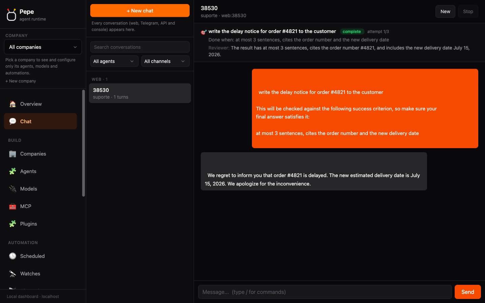
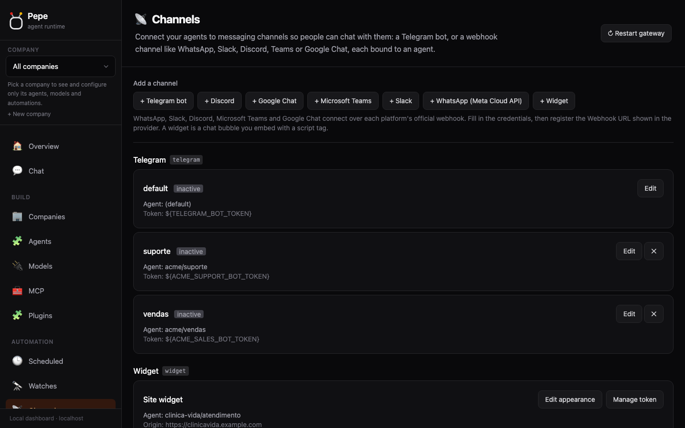
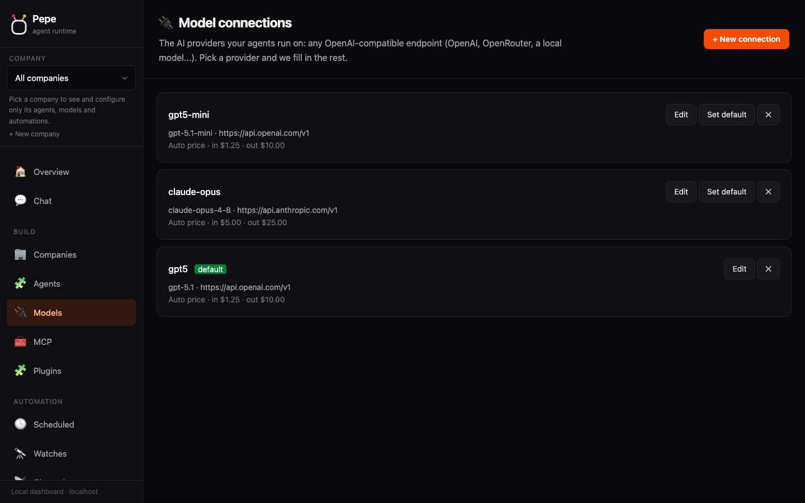
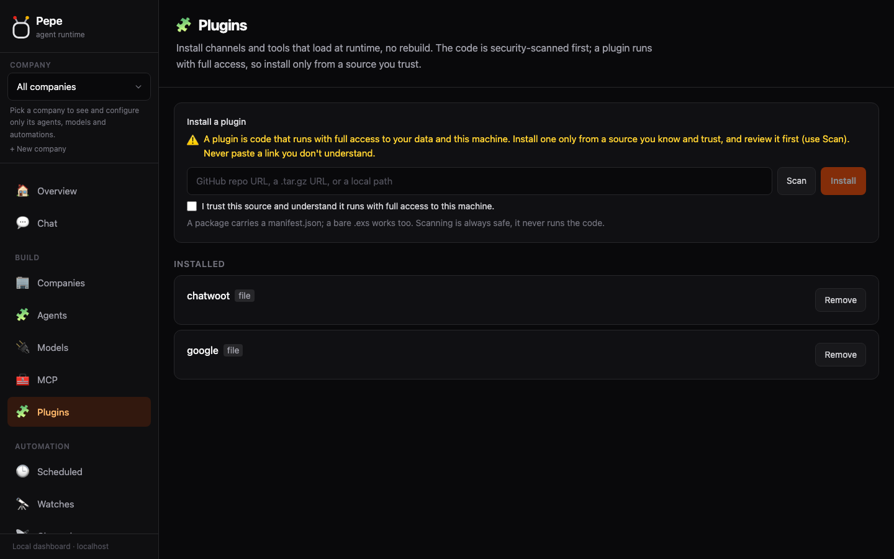
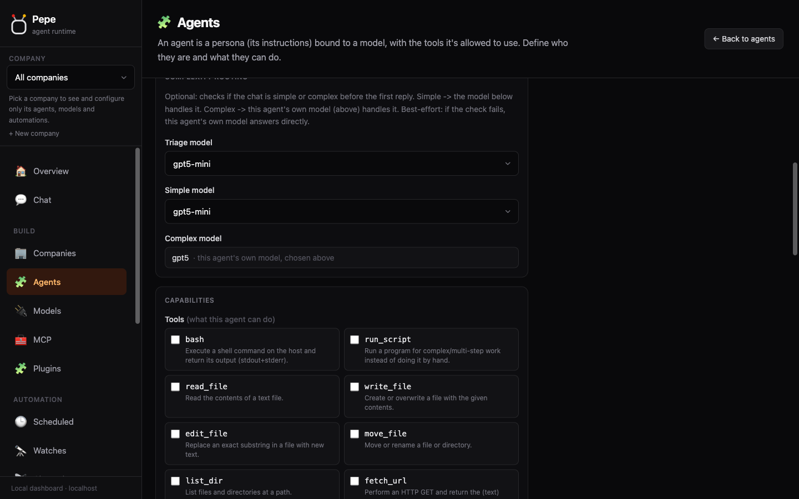

<p align="center">
  
</p>

<h1 align="center">Pepe</h1>

<p align="center">
  <strong>An Elixir/OTP AI agent runtime.</strong> Define agents, connect to any model, and run a tool-calling loop.
</p>

<p align="center">
  Web dashboard &nbsp;·&nbsp; OpenAI-compatible HTTP &nbsp;·&nbsp; WebSocket &nbsp;·&nbsp; Telegram &nbsp;·&nbsp; WhatsApp &nbsp;·&nbsp; CLI
</p>

<p align="center">
  <a href="https://pepe-agent.com"><strong>Website</strong></a>
  &nbsp;·&nbsp;
  <a href="https://pepe-agent.com/en/docs/">Documentation</a>
  &nbsp;·&nbsp;
  <a href="https://pepe-agent.com/en/docs/quickstart/">Quickstart</a>
  &nbsp;·&nbsp;
  <a href="https://github.com/sponsors/jhonathas"></a>
</p>

> **Where Pepe comes from.** Pepe was born out of solving real problems across
> a range of companies I provided development services to: some needed a
> simple way to run their marketing without expanding headcount; others
> wanted to connect their ERP and database to an agent capable of answering
> their team's questions, without compromising on security. The project
> didn't start as open source: it was internal, proprietary tooling,
> custom-built for each client. But the results proved consistent enough,
> across different enough businesses, that I decided to give it a name, an
> identity of its own, and release it as open source, for anyone to use and
> contribute to.

> **Why "Pepe"?** The name nods to Chespirito's comedy universe, loved across
> Latin America generations grew up with. The character's whole thing? **He
> did exactly what he was told.** No arguing, no improvising beyond the
> order. Which, funnily enough, describes an AI agent runtime perfectly.
> The project was once called *Cortex*; now it's **Pepe**. Same engine, better name. 🫡

Under the hood, it leans on what Elixir is good at: a lightweight process per
conversation (so many run side by side), supervision that isolates crashes (one
conversation failing never takes the rest down), and a small streaming HTTP stack.

It exposes those core capabilities several ways:

| Surface | Endpoint | Use it for |
|---|---|---|
| **Web dashboard** | `GET /` (Phoenix LiveView) | Browse sessions and chat from the browser |
| **OpenAI-compatible HTTP** | `POST /v1/chat/completions`, `GET /v1/models` | Point any OpenAI SDK / LangChain / `curl` at Pepe |
| **Usage HTTP API** | `GET /v1/usage`, `/usage/events`, `/usage/runs`, `/usage/runs/:id` | Read what was spent, per message, from a client's billing system |
| **WebSocket** | `ws://.../socket/websocket`, topic `agent:<name>` | Live, token-streamed conversations |
| **Telegram** | a Telegram bot | Chat with your agent from your phone |
| **Terminal console** | `mix pepe tui` | An interactive console that remembers the conversation |
| **CLI** | `mix pepe ...` | Create agents & model connections, run, serve |

Everything talks to providers over the **OpenAI Chat Completions** protocol, so
OpenAI, OpenRouter, Together, Groq, DeepSeek,
Mistral, z.ai/GLM, Kimi/Moonshot, MiniMax, NovitaAI, Ollama, LM Studio, vLLM,
llama.cpp and any other compatible endpoint work with zero code changes.

<p align="center">
  
</p>

---

## Quick start

### Install and use

Grab the self-contained `pepe` binary (macOS, Linux, Windows; no root, no runtime to install):

```bash
curl -fsSL https://pepe-agent.com/install.sh | sh

# 1) scaffold ~/.pepe/config.json (guided, interactive)
pepe setup

# 2) add a model connection (any OpenAI-compatible provider; openrouter is a
#    known provider, so its base URL is filled in automatically)
pepe model add openrouter --api-key '${OPENROUTER_API_KEY}' --model openai/gpt-5-chat

# 3) define an agent (defaults to all built-in tools; the first model/agent
#    you add becomes the default automatically)
pepe agent add assistant --prompt "You are Pepe, a helpful assistant."

# 4) run it
export OPENROUTER_API_KEY=sk-...
pepe run "summarize what this project does"

# 5) or run it toward an outcome: it works, an independent reviewer checks the
#    result against your criterion, and it retries until that criterion is met
pepe goal "write release notes for this version" \
  --criteria "mentions every change in CHANGELOG's Unreleased section, in one line each"
```

See the [quickstart guide](https://pepe-agent.com/en/docs/quickstart/) for the full walkthrough.

### Run toward a goal, not just a prompt

A prompt gets you one turn: the agent answers, and *you* decide whether it's good
enough. A **goal** gets you an outcome: you state what "done" means, and Pepe keeps
working until an **independent reviewer** (a separate model call that only sees your
criterion and the result, never the working conversation) agrees it's met, or the
attempt cap is reached.

```bash
pepe goal "OBJECTIVE" --criteria "how we know it's done" \
  [--max-attempts 3] [--judge MODEL] [--agent NAME]
```

Also on the dashboard: `/goal <objective> | <success criterion>` in any chat. The
panel above the conversation shows the criterion, the attempt count, and the
reviewer's last verdict as it runs.

### Talk to it out loud

A voice note sent to a Telegram bot arrives as **text**: transcribed on the way in,
before the agent runs, so slash commands and mention rules work by voice too. Needs no
configuration if you already have a model connection to OpenAI or Groq, or point at a
local command to keep audio on the machine:

```bash
mix pepe media audio --model groq --language en
mix pepe media audio --command "whisper-cli -f {file}"   # keep audio on the machine
```

Replies can come back as voice too (`media.tts`), and a photo goes to a vision-capable
model as the actual image, not a filename. Full detail (flags, fallback chains, image
caps) in the [Voice messages](https://pepe-agent.com/en/docs/voice/) docs.

### Docker

```bash
docker run -d --name pepe -p 4000:4000 \
  -v pepe-data:/data -v pepe-tools:/tools \
  -e PEPE_DASHBOARD_PASSWORD=a-strong-password \
  ghcr.io/pepe-agent/pepe
```

Open <http://localhost:4000>. Images are published for `amd64` and `arm64` from the
same release tag, so `docker pull` resolves to the right one on an M-series Mac or a
server.

Two things are not optional, and both fail quietly if skipped:

- **The volumes.** `/data` holds config, agents and conversations, and is what you
  back up. `/tools` holds single-file CLIs the agent installs for itself, kept apart
  so a backup carries state rather than regenerable, architecture-specific binaries.
- **The dashboard password.** A container is not loopback, so Pepe's network guard
  treats it as public: with no password, every request gets a 403.

To give the agent a tool inside the container, a single-file CLI (`op`, `gh`,
`kubectl`) goes in `/tools`, which is on the PATH, so it survives a new container
without root or a rebuild. A system package (`psql`, `imagemagick`) has to go in the
image, either through the `PEPE_IMAGE_APT_PACKAGES` build argument or a derived
image, because anything `apt` installs dies with the container. `ffmpeg` is
deliberately not in the image: neither transcription route needs it, and Debian's
package pulls 204 packages to serve a GPU video stack a headless container never
touches, which is what keeps the image at 408 MB rather than 945 MB. See the
[Docker docs](https://pepe-agent.com/en/docs/docker/), and
[`docker-compose.yml`](docker-compose.yml) if you'd rather `docker compose up -d`.

### From source (development)

Clone the repo and drive it with `mix` instead of the binary: same steps as above,
with `mix pepe` in place of `pepe`.

```bash
git clone https://github.com/pepe-agent/pepe.git && cd pepe
mix deps.get
mix pepe setup
mix pepe model add openrouter --api-key '${OPENROUTER_API_KEY}' --model openai/gpt-5-chat
mix pepe agent add assistant --prompt "You are Pepe, a helpful coding agent."
export OPENROUTER_API_KEY=sk-...
mix pepe run "list the files here and summarize the project"
```

## Documentation

**The docs live at [pepe-agent.com/docs](https://pepe-agent.com/en/docs/)**, in English,
Portuguese and Spanish. One topic per page; open just what you need.

**Start** &nbsp; [Install](https://pepe-agent.com/en/docs/install/) · [Docker](https://pepe-agent.com/en/docs/docker/) · [Quickstart](https://pepe-agent.com/en/docs/quickstart/)

**Configure** &nbsp; [Models](https://pepe-agent.com/en/docs/models/) · [Agents](https://pepe-agent.com/en/docs/agents/) · [Configuration](https://pepe-agent.com/en/docs/config/) · [Secrets & vaults](https://pepe-agent.com/en/docs/secrets/) · [Usage & billing](https://pepe-agent.com/en/docs/billing/) · [Projects](https://pepe-agent.com/en/docs/projects/)

**What an agent can do** &nbsp; [Skills](https://pepe-agent.com/en/docs/skills/) · [PepeHub](https://hub.pepe-agent.com) (skill/plugin marketplace) · [Learning](https://pepe-agent.com/en/docs/learning/) (memory search included) · [Agent-to-agent routing](https://pepe-agent.com/en/docs/routing/) · [Delegation](https://pepe-agent.com/en/docs/delegation/) · [Admin agents](https://pepe-agent.com/en/docs/admin-agents/) · [Session search](https://pepe-agent.com/en/docs/session-search/) · [Browser](https://pepe-agent.com/en/docs/browser/) · [Fetch URL](https://pepe-agent.com/en/docs/fetch-url/)

**Talk to it** &nbsp; [Dashboard](https://pepe-agent.com/en/docs/dashboard/) · [HTTP API](https://pepe-agent.com/en/docs/api/) · [Usage API](https://pepe-agent.com/en/docs/usage-api/) · [WebSocket](https://pepe-agent.com/en/docs/websocket/) · [Telegram](https://pepe-agent.com/en/docs/telegram/) · [WhatsApp](https://pepe-agent.com/en/docs/whatsapp/) · [Slack, Discord, Teams, Chat](https://pepe-agent.com/en/docs/channels/) · [Widget](https://pepe-agent.com/en/docs/widget/)

**Automate & operate** &nbsp; [Goals](https://pepe-agent.com/en/docs/goals/) · [Scheduled tasks](https://pepe-agent.com/en/docs/scheduled/) · [Flows](https://pepe-agent.com/en/docs/flows/) · [Board](https://pepe-agent.com/en/docs/board/) · [Watches](https://pepe-agent.com/en/docs/watches/) · [MCP servers](https://pepe-agent.com/en/docs/mcp/) · [Plugins](https://pepe-agent.com/en/docs/plugins/) · [Security](https://pepe-agent.com/en/docs/security/) · [Privacy hooks](https://pepe-agent.com/en/docs/privacy/) · [Traces](https://pepe-agent.com/en/docs/traces/) · [Evals](https://pepe-agent.com/en/docs/evals/)

### In this repository

Only what you read when you are working *on* Pepe rather than *with* it. Everything a
user reads lives on the site, once, so the two cannot drift apart, which is precisely
what they did while there were two copies.

[Architecture](docs/architecture.md) · [CLI reference](docs/cli-reference.md) · [Adding a tool](docs/adding-a-tool.md) · [Tests](docs/tests.md) · [Migrating from another runtime](docs/migrating.md) · [Contributing & help wanted](docs/contributing.md)

**More screenshots**

| | |
|---|---|
|  |  |
|  |  |

---

## Put it in your product

Pepe is meant to be embedded. A few common paths:

- **Behind your web app / SaaS**: point any OpenAI SDK at the [HTTP API](https://pepe-agent.com/en/docs/api/), scope access with per-project [tokens](https://pepe-agent.com/en/docs/auth/), and keep tenants isolated with [Projects](https://pepe-agent.com/en/docs/projects/).
- **Customer support on WhatsApp**: connect a number and bind it to a support agent; see [WhatsApp](https://pepe-agent.com/en/docs/whatsapp/). Redact PII before it reaches any model with [Privacy hooks](https://pepe-agent.com/en/docs/privacy/).
- **Bill your clients**: every model call is metered per project; export invoices from [Usage & billing](https://pepe-agent.com/en/docs/billing/), or let their own system read the figures over HTTP with a read-only token via the [Usage API](https://pepe-agent.com/en/docs/usage-api/).
- **Automate**: recurring jobs with [Scheduled tasks](https://pepe-agent.com/en/docs/scheduled/), one-shot "notify me when X" with [Watches](https://pepe-agent.com/en/docs/watches/), durable multi-step handoffs with [Board](https://pepe-agent.com/en/docs/board/).

---

## Contributing: help wanted 🙌

**Help is genuinely welcome**: bug reports, docs fixes, features, and especially
**confirming providers work**. Small, focused PRs are the easiest to review and merge.

Get set up in a minute (no database, no API keys needed for the test suite):

```bash
git clone https://github.com/pepe-agent/pepe.git && cd pepe
mix deps.get
mix test          # the whole suite, over real TCP - no DB, no keys
```

Then fork the repo on GitHub, clone your fork, branch off `master`, make your change
(match the style in `AGENTS.md`), run `mix precommit`, and push:

```bash
git checkout -b my-fix
# ... make your change ...
git push -u origin my-fix
```

Open a PR against `pepe-agent/pepe:master` from your fork (GitHub shows a "Compare &
pull request" button after the push). Adding a tool? Follow
[Adding a tool](docs/adding-a-tool.md).

**The single most useful thing you can do:** I run Pepe day-to-day on one setup
(the ChatGPT/Codex OAuth subscription), so most providers are unverified. If you use
OpenRouter, Groq, DeepSeek, Together, Mistral, Ollama, LM Studio, the Claude Pro/Max
sign-in, or anything else, run `mix pepe model test`, try one prompt, and open an
issue saying whether **streaming** and **tool-calling** worked. That feedback is worth
a lot.

Full guide, including everything that needs testing: [Contributing & help wanted](docs/contributing.md).

---

## Support

If Pepe is useful to you, [sponsoring](https://github.com/sponsors/jhonathas) helps
cover the real cost of keeping it working across providers: verifying new models,
testing streaming/tool-calling against paid APIs (OpenRouter, Groq, DeepSeek,
Together, ...), and the time spent maintaining it.

## License

[MIT](LICENSE)
