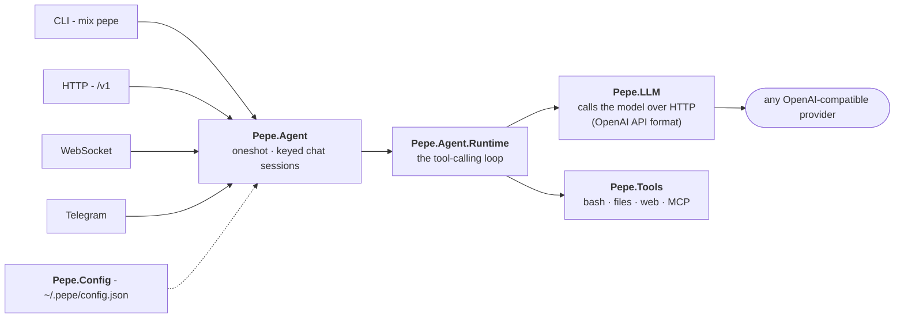

# Architecture

Four surfaces feed one facade. The runtime then loops (**call the model -> run any
tool calls -> feed the results back**) until it has a final answer. Everything is
configured from a single JSON file; there is no database.

| Module | What it does |
|---|---|
| **`Pepe.Config`** | File-backed store at `~/.pepe/config.json`. Secrets written as `${ENV_VAR}` are interpolated at read time. No database. |
| **`Pepe.LLM`** | Talks to the model over HTTP in the OpenAI API format, either waiting for the whole reply or streaming it token by token. Reassembles streamed tool calls from fragments. |
| **`Pepe.Tools`** | A `@behaviour` plus a built-in registry (`bash`, `read_file`, `write_file`, `edit_file`, `fetch_url`, `web_search`, `skill`, self-config tools...). Drop-in `.exs` plugins extend it with no recompile. |
| **`Pepe.Agent.Runtime`** | The conversation loop: call model -> run tools -> feed back -> repeat until a final answer or `max_iterations`. Emits lifecycle events (`:assistant_delta`, `:tool_call`, `:tool_result`, `:done`). |
| **`Pepe.Agent.Session`** | One `GenServer` per conversation key (e.g. `telegram:12345`), under a `DynamicSupervisor` + `Registry`. Runs execute off-process, so a session stays responsive (e.g. to `/stop`). Crash isolation and context retention for free. |
| **`Pepe.Permissions`** | Gates risky tool calls (running code, writing files, changing config). Each surface renders the prompt natively; read-only tools run freely. |
| **Gateways** | `Pepe.Gateways.Telegram` (long polling) and `Pepe.Gateways.TUI` (the `pepe chat` console). They start only on `serve`/`gateway`, so a local `run`/`chat` never spins up the poller. |

> **Web vs non-web surfaces.** `lib/pepe/gateways/` holds the non-web surfaces (the
> Telegram poller, the `pepe chat` console). Everything served by the Phoenix endpoint
> (the OpenAI-compatible API, the WebSocket channel, and the LiveView dashboard) lives
> in `lib/pepe_web/`.

---

---

[Back to the docs index](../README.md#documentation)
