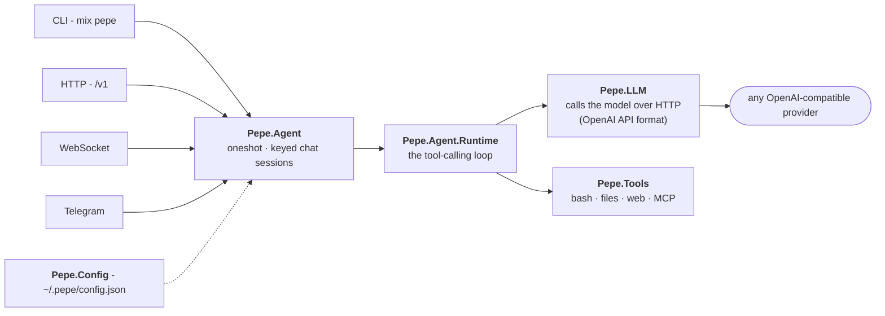

# Architecture

Four surfaces feed one facade. The runtime then loops (**call the model -> run any
tool calls -> feed the results back**) until it has a final answer. Everything is
configured from a single JSON file; there is no database.

```mermaid
flowchart LR
    CLI["CLI - mix pepe"] --> AG
    API["HTTP - /v1"] --> AG
    WS["WebSocket"] --> AG
    TG["Telegram"] --> AG

    AG["<b>Pepe.Agent</b><br/>oneshot · keyed chat sessions"] --> RT
    RT["<b>Pepe.Agent.Runtime</b><br/>the tool-calling loop"] --> LLM
    RT --> TL["<b>Pepe.Tools</b><br/>bash · files · web · MCP"]
    LLM["<b>Pepe.LLM</b><br/>calls the model over HTTP<br/>(OpenAI API format)"] --> PROV(["any OpenAI-compatible provider"])
    CFG["<b>Pepe.Config</b> - ~/.pepe/config.json"] -.-> AG
```

| Module | What it does |
|---|---|
| **`Pepe.Config`** | File-backed store at `~/.pepe/config.json`. Secrets written as `${ENV_VAR}` are interpolated at read time. No database. |
| **`Pepe.LLM`** | Talks to the model over HTTP in the OpenAI API format, either waiting for the whole reply or streaming it token by token. Reassembles streamed tool calls from fragments. |
| **`Pepe.Tools`** | A `@behaviour` plus a built-in registry (`bash`, `read_file`, `write_file`, `edit_file`, `fetch_url`, `web_search`, `skill`, self-config tools...). Drop-in `.exs` plugins extend it with no recompile. |
| **`Pepe.Agent.Runtime`** | The conversation loop: call model -> run tools -> feed back -> repeat until a final answer or `max_iterations`. Emits lifecycle events (`:assistant_delta`, `:tool_call`, `:tool_result`, `:done`). |
| **`Pepe.Agent.Session`** | One `GenServer` per conversation key (e.g. `telegram:12345`), under a `DynamicSupervisor` + `Registry`. Runs execute off-process, so a session stays responsive (e.g. to `/stop`). Crash isolation and context retention for free. |
| **`Pepe.Permissions`** | Gates risky tool calls (running code, writing files, changing config). Each surface renders the prompt natively; read-only tools run freely. |
| **Gateways** | `Pepe.Gateways.Telegram` (long polling) and `Pepe.Gateways.TUI` (the `pepe chat` console). They start only on `serve`/`gateway`, so a local `run`/`chat` never spins up the poller. |

> **Web vs non-web surfaces.** `lib/pepe/gateways/` holds the non-web surfaces (the
> Telegram poller, the `pepe chat` console). Everything served by the Phoenix endpoint
> (the OpenAI-compatible API, the WebSocket channel, and the LiveView dashboard) lives
> in `lib/pepe_web/`.

## Extension points

`Pepe.Plugins.implementing/1` is the one discovery primitive (a loaded `.exs` module
exporting a given `{fun, arity}` set) that powers every plugin-facing surface. Each surface
picks one of two shapes, and picking the right one matters:

| Shape | Used by | Rule |
|---|---|---|
| **Additive** | `Pepe.Tools.Tool`, `Pepe.Webhooks.Provider`, `Pepe.LLM.Adapter`, `Pepe.Gateways.Channel`, `Pepe.Agent.RunObserver`, `Pepe.Hooks.Hook`, `Pepe.Realtime.Provider`, `Pepe.PluginRoute` | Many plugins coexist. A name clash resolves per-registry: a builtin tool always wins (`Pepe.Tools.all/0`); a plugin webhook provider wins over a builtin of the same name (`Pepe.Webhooks.registry/0` - `Map.merge/2`'s second-arg-wins rule, deliberately, so a bundled provider is replaceable); an LLM adapter's builtins (`"openai-responses"`, `"anthropic-messages"`) can never be overridden; a builtin hook (`pii_redact`, `llm_redact`, `http_redact`, `presidio`) always wins, same rule as Tools; a run observer has no name collision to resolve at all (every installed one that subscribes runs); a `Pepe.Realtime.Provider` has no exclusivity either - a client picks one by name per WebSocket connection (`PepeWeb.RealtimeChannel`'s join payload), so several can be installed and used by different connections at once, unlike a slot's one-occupant-per-agent rule. A `Pepe.Webhooks.Provider`'s optional `deliver_blocks/3` renders `Pepe.Presentation` blocks (the `send_presentation` tool) into the platform's native UI - Slack does today (real Block Kit); a provider without it still delivers, via `Pepe.Webhooks.deliver_blocks/4`'s own fallback to `Pepe.Presentation.to_text/1` + the provider's ordinary `deliver/3` - a shared, cross-channel structured-content contract instead of every channel inventing its own. `Pepe.PluginRoute` is additive with a second, explicit gate beyond discovery: a plugin claiming `/plugin-routes/:plugin/*path` answers nothing until `Pepe.Config.enable_http_route_plugin/1` names it - installing the plugin file alone exposes nothing, since (unlike a tool) a route answers any inbound request, not one the model chose to make. |
| **Fail-closed veto** | `Pepe.Permissions.Policy` | The one deliberate exception to "a plugin degrades to as-if-not-installed": every installed policy in scope for the calling agent (see below) is consulted on every `Pepe.Permissions.gate/3` call, and a crash/timeout/malformed return DENIES rather than allows - a security check that couldn't run is not the same as one that passed. `check/3` returns `:allow`, `:ask`/`{:ask, reason}` (forces a human prompt even for a call that would've been silently pre-approved), or `:deny`/`{:deny, reason}` - most restrictive wins across every installed policy. Checked before the gate's own pre-approval logic, so a veto/ask overrides even an `:always` grant - a narrow, fail-closed choke point kept deliberately separate from the general (fail-open) hook bus. **Scope, not opt-in**: `Pepe.Config.policy_scope/1` (`"policy_scope"` in `config.json`, by agent name and/or project - `mix pepe policy scope`) limits which agents a policy is even consulted for, set by the operator; unscoped (the default) means every agent, and an agent can never narrow its own scope - that would defeat the fail-closed guarantee. `Pepe.Permissions.Policy.check_run/3` (optional) is the same veto a level up: consulted once per run, before the first model call, so a policy can refuse an entire run (not just one tool call) based on who's talking and what they said. |
| **Exclusive (a slot)** | `Pepe.Slots` - `memory` (`Pepe.Memory.Backend`), `web_search` (`Pepe.Search.Backend`), `sandbox` (`Pepe.Sandbox` - *where*/*how* `bash`/`run_script` actually execute a command, not just whether one is allowed to), `compaction` (`Pepe.Agent.Compaction` - how a long conversation gets condensed to fit the model's window), and `harness` (`Pepe.Agent.Harness` - the entire reasoning loop, not one call) | Exactly one occupant answers, per agent. The builtin is the default, not special-cased code; the operator pins a different one installation-wide (`slots.<name>`, `mix pepe slot set`), a project can set its own `default_slots`, and an agent can override either via its own `slots` field (`mix pepe agent add NAME --slots memory:PLUGIN`) - resolution is agent -> project -> installation-wide -> builtin, via `Pepe.Slots.occupant/2` (mirrors `Pepe.Hooks`' `hooks`/`default_hooks` precedence). A plugin claims a slot via `slot/0`, disambiguating it from other slots whose fun sets could otherwise collide. Every call to a non-default occupant goes through `Pepe.Slots.Guard` (an unlinked `Task` that enforces its own timeout, independent of whether the caller comes back for the result), degrading to the default on a crash, timeout, or malformed return (tuple shape *or* payload shape - see `Pepe.Slots.validator_for/1`) for most slots (`degrade: :fallback`) - a misbehaving occupant changes answer quality, never breaks a turn. `sandbox` sets `degrade: :error` instead: falling back would mean silently running the agent's command on the local host the moment an isolation backend fails, exactly the boundary the slot exists to hold. `Pepe.Slots.Health` remembers the last failure per slot for `pepe doctor`/`slot list`, cleared on the occupant's next clean success. **`harness` is the one slot `Pepe.Agent.Runtime` does NOT dispatch through `Pepe.Slots.Guard`** - a harness occupant runs in the turn-owning process (not an isolated `Task`) because it calls back into `Pepe.Permissions`/`Pepe.Tools` exactly as `Pepe.Agent.Runtime`'s own loop does, and both read turn state (taint, run grants) from that process's dictionary, which `Guard`'s isolated `Task` deliberately withholds. It also sets `degrade: :error`, for the same non-idempotency reason as `sandbox`: a crashed harness may already have taken real action through its own means. See `Pepe.Agent.Harness`'s moduledoc. |

A persistent-connection channel (`Pepe.Gateways.Channel` - Discord/Matrix-shaped, needs a
long-lived websocket rather than an inbound webhook) runs under
`Pepe.Gateways.PluginSupervisor`, its own crash domain nested under
`Pepe.Gateways.Supervisor`, registered there `restart: :transient` - so when
`PluginSupervisor` itself gives up (exhausts its own restart budget and exits
`:shutdown`), the parent does NOT respawn it (a plain `:permanent` child, the `Supervisor`
default, would - and could exhaust the *parent's* budget doing so, taking Telegram down
with it). The plugin-channel domain goes dark until the next `reload_plugins/0` instead.

**A fifth shape, additive but not a registry lookup at all: `Pepe.Agent.RunObserver`.**
Any number of installed observer plugins get told, asynchronously and read-only, which
`Pepe.Agent.Runtime` lifecycle events fired during a run - see `Pepe.Agent.RunObservers`.
Dispatch never happens in the run-owning process: one unlinked "runner" process per run
receives a bare `send/2` per event (never a wait, never a reply) and calls each
subscribed observer serially, so a hung or crashing observer only ever slows down its own
run's runner. Unlike `Pepe.Slots.Guard`, this doesn't reuse a synchronous yield/shutdown
pattern - there is no return value to wait for, so a per-event Task would only add
latency to the hottest path in the system for no benefit. An observer that fails 3 times
in a row is disabled across every future run (`Pepe.Agent.RunObservers.Health`, ETS-backed
- a per-run counter would reset every turn and never actually disable anything) until
manually reset. This is deliberately NOT `Pepe.Hooks` (the synchronous, opt-in,
text-mutating PII-redaction pipeline threaded through the message flow) - same loop,
opposite mechanism, not sharing a name on purpose.

Every plugin-facing registry above reads a plugin's own metadata (`name/0`, `slot/0`,
`api/0`, `subscriptions/0`) through `Pepe.Plugins.safe_call/3`, not a raw `apply/3`: this
code runs in the caller's own process, before any of the per-call isolation above (Guard,
`PluginSupervisor`'s own children, an observer's runner) has a chance to exist - a plugin
whose metadata itself raises must not crash whoever was just trying to route around it.
`Pepe.Plugins.modules/0` also compiles a plugin `.exs` under its own timeout, for the same
reason one level earlier: a file that hangs (not raises) while loading would otherwise
freeze every one of these surfaces indefinitely, not just the plugin that hung.

See the website's [Plugins](../website/src/docs/en/plugins.md) and
[Slots](../website/src/docs/en/slots.md) pages for the operator-facing version.

---

---

[Back to the docs index](../README.md#documentation)
